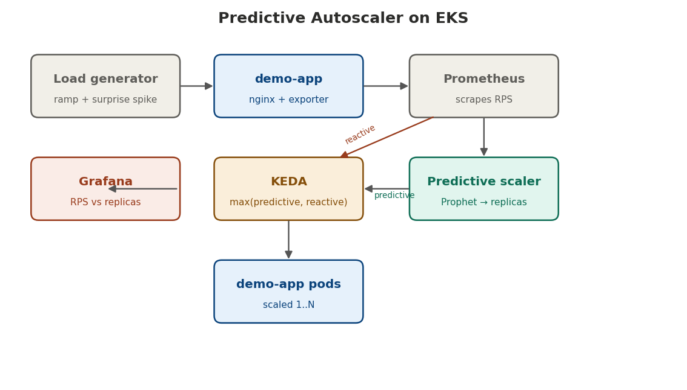
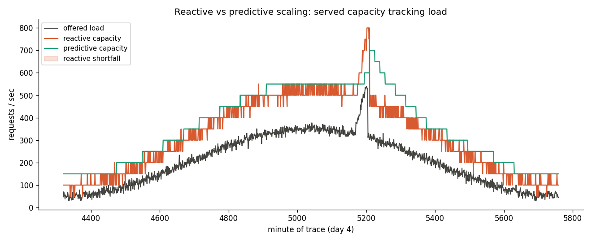

# Predictive Autoscaler on EKS

Proactive Kubernetes autoscaling for AWS EKS. A Prophet forecaster predicts
near-future request load and pre-scales the workload **before** traffic
arrives, while KEDA stays underneath as a reactive safety net. The forecaster
is swappable; the scaling decision itself is boring, auditable arithmetic — not
an LLM.

---

## Architecture



The load generator drives the demo app; Prometheus scrapes its request rate.
The predictive scaler reads that history, forecasts the next few minutes with
Prophet, and serves a replica count at `/desired-replicas`. KEDA polls that
endpoint **and** a reactive Prometheus trigger, taking the max of the two — so
the forecast is a floor, never a ceiling. If the predictive path dies, the
cluster degrades gracefully to ordinary reactive autoscaling.

---

## Does it actually help?

The offline simulation replays a 4-day per-minute trace with a realistic daily
rhythm, a 4-minute pod cold-start, and one unplanned spike. Scored over the
same post-warmup window:

| scaler                | under-provisioned min | pod-minutes | dropped load |
| --------------------- | --------------------: | ----------: | -----------: |
| reactive HPA          |                    25 |      26,965 |        252.1 |
| predictive (Prophet)  |                     0 |      30,295 |          0.0 |

Predictive scaling eliminated cold-start shortfall on the predictable ramp for
~12% more pod-minutes. That tradeoff is the whole point: it spends a little
extra capacity to remove the lag reactive scaling suffers during a ramp.



Reproduce the table and chart with **no cluster required**:

```bash
pip install -e .
python -m sim.compare      # writes screenshots/comparison.png
```

### What it does NOT do

Look at the spike near the end of the chart: the predictive line does not
anticipate it. Prophet forecasts recurring patterns (daily, weekly); it is
blind to genuinely unplanned events and reacts to those no faster than plain
HPA. The live demo shows this honestly — the reactive KEDA trigger is what
catches the surprise spike.

---

## Production readiness — what's in and what isn't

This started as a portfolio demo. After a code review, the following
production-grade behaviours were added:

| Concern             | How it's addressed                                                                                          |
| ------------------- | ----------------------------------------------------------------------------------------------------------- |
| Prophet refit cost  | `CachedProphet` refits on a TTL (default 3 min), predicts every call. Roughly **46× faster** per poll.      |
| Cold-cluster warmup | `GraduatedForecaster` runs `SeasonalNaive` until ~1 day of history accumulates, then promotes to Prophet.   |
| Scaler as SPOF      | 2 replicas + PodDisruptionBudget; a node drain can't leave KEDA with the reactive trigger alone.            |
| State on restart    | `_last` persisted to disk (atomic write); a pod restart recovers the last decision instead of resetting.    |
| Prometheus hangs    | 5s timeout on every HTTP call to Prometheus; never blocks the FastAPI thread indefinitely.                  |
| Image hardening     | Multi-stage build, non-root user (uid 10001), `readOnlyRootFilesystem`, all caps dropped, seccomp default.  |
| Network isolation   | NetworkPolicy: ingress from KEDA only, egress to Prometheus + DNS only.                                     |
| EKS public API      | `cluster_endpoint_public_access_cidrs` variable — default is open for demos; pin to your CIDR in prod.      |
| Image pinning       | CI publishes both `:latest` and `:<git-sha>`; production deploys should pass the SHA tag.                   |

**Known caveats for production:**

- The NetworkPolicy requires a CNI that **enforces** policies. EKS's default
  VPC CNI does *not* — enable the EKS network-policy add-on or install Calico,
  otherwise the policy is silently a no-op.
- `image.tag` defaults to `latest` in `values.yaml` for demo ergonomics. The
  deploy script warns about this. For production, pass the SHA tag from CI's
  job summary: `./scripts/deploy.sh ghcr.io/<owner>/predictive-scaler:<sha>`.
- `prometheus-api-client` is a reasonable dep but somewhat unmaintained; a
  direct `httpx` call against the Prometheus HTTP API would be ~10 lines and
  one fewer dependency. Marked as future cleanup.

---

## Tech stack

| Layer            | Technology                              | Purpose                                              |
| ---------------- | --------------------------------------- | ---------------------------------------------------- |
| Infrastructure   | AWS EKS, VPC                            | Managed Kubernetes                                   |
| IaC              | Terraform **1.10+**, S3 native locking  | Reproducible cluster (no DynamoDB needed)            |
| Forecasting      | Prophet (swappable via `Forecaster`)    | Predicts near-future load, fit-cached on a TTL       |
| Scaling          | KEDA                                    | Predictive `metrics-api` + reactive Prometheus trigger |
| Service          | Python 3.12 + FastAPI                   | Serves `/desired-replicas` to KEDA                   |
| Observability    | kube-prometheus-stack, Grafana          | Metrics + dashboards                                 |
| Demo workload    | nginx + nginx-prometheus-exporter       | Emits the request-rate metric                        |
| Packaging        | Docker (multi-stage, non-root, ROFS)    | Hardened scaler image                                |
| CI/CD            | GitHub Actions + GHCR                   | Test, run sim, build + push `:latest` and `:<sha>`   |

---

## Prerequisites

You need these installed locally: `aws` CLI v2, **Terraform >= 1.10** (uses S3
native state locking, not available in earlier versions), `kubectl` (pin to
1.32), `helm` v3, and `docker`. Configure AWS credentials (`aws sts
get-caller-identity` should show your account ID).

---

## Quick start — offline (free, no AWS)

```bash
pip install -e .
python -m pytest tests/ -q     # 14 tests
python -m sim.compare          # regenerates the comparison chart
```

This is enough to showcase the core idea: working code, passing tests, and a
chart proving the predictive vs reactive tradeoff.

---

## Live demo on EKS — step by step

> The live cluster costs money while it runs (see the cost table). Spin it up,
> record the demo, then tear it down.

### 1. Provision the cluster

```bash
export AWS_REGION=ap-south-1
export TF_STATE_BUCKET="my-tf-state-$(aws sts get-caller-identity --query Account --output text)"

aws s3api create-bucket --bucket "$TF_STATE_BUCKET" --region "$AWS_REGION" \
  --create-bucket-configuration LocationConstraint="$AWS_REGION"

cp terraform/terraform.tfvars.example terraform/terraform.tfvars   # edit as needed

cd terraform
terraform init -backend-config="bucket=${TF_STATE_BUCKET}" -backend-config="region=${AWS_REGION}"
terraform apply
cd ..
```

> For production, set `cluster_endpoint_public_access_cidrs` in
> `terraform.tfvars` to your office or VPN egress CIDR. The default
> (`["0.0.0.0/0"]`) is open for demo convenience.

### 2. Point kubectl at the cluster

```bash
make kubeconfig
kubectl get nodes
```

### 3. Install add-ons (metrics-server, Prometheus/Grafana, KEDA)

```bash
make addons
```

### 4. Build + push the scaler image (or use the public GHCR image)

CI publishes `ghcr.io/<owner>/predictive-scaler:latest` *and* `:<git-sha>` on
every push to main. The job summary surfaces the pinned tag for production
deploys. To build locally:

```bash
docker build -t ghcr.io/<owner>/predictive-scaler:<git-sha> .
docker push ghcr.io/<owner>/predictive-scaler:<git-sha>
```

### 5. Deploy the demo

```bash
# Demo (uses :latest, prints a warning):
make deploy

# Production-style (pinned image tag):
./scripts/deploy.sh ghcr.io/<owner>/predictive-scaler:<git-sha>
```

This deploys the demo app, the load generator, the ServiceMonitor, and the
predictive scaler Helm chart (which creates the KEDA ScaledObject,
PodDisruptionBudget, and NetworkPolicy).

### 6. Run the guided demo

```bash
make demo                # narrates the scaling behaviour
make port-forward        # Grafana :3000 (admin/admin), Prometheus :9090
```

Watch `demo-app` replicas rise **ahead** of each load ramp (the forecast
working), then watch the reactive trigger catch the surprise spike. Capture
screenshots and drop them in `screenshots/`.

---

## Configuration

The scaler is tuned via Helm values (`helm/predictive-scaler/values.yaml`),
passed to the service as env vars:

| Helm value                    | Env var                  | Default | Description                                    |
| ----------------------------- | ------------------------ | ------- | ---------------------------------------------- |
| `scaler.forecaster`           | `FORECASTER`             | prophet | `prophet` (graduated, cached) or `naive`       |
| `scaler.capacityPerPod`       | `CAPACITY_PER_POD`       | 50      | load one pod serves (req/s)                    |
| `scaler.headroom`             | `HEADROOM`               | 0.3     | safety buffer on the forecast upper bound      |
| `scaler.minReplicas`          | `MIN_REPLICAS`           | 1       | hard floor                                     |
| `scaler.maxReplicas`          | `MAX_REPLICAS`           | 20      | hard ceiling                                   |
| `scaler.horizonMin`           | `HORIZON_MIN`            | 10      | minutes ahead to forecast                      |
| `scaler.refitAfterSec`        | `REFIT_AFTER_SEC`        | 180     | Prophet refit cadence (cache TTL)              |
| `scaler.graduateAtRows`       | `GRADUATE_AT_ROWS`       | 1440    | promote from SeasonalNaive to Prophet at N rows |
| `scaler.prometheusTimeoutSec` | `PROMETHEUS_TIMEOUT_SEC` | 5       | per-request Prometheus timeout                 |
| `scaler.stateFilePath`        | `STATE_FILE_PATH`        | /tmp/predictive-scaler-state.json | persistence path (emptyDir)      |
| `reactive.threshold`          | —                        | 35      | reactive trigger RPS threshold                 |
| `networkPolicy.enabled`       | —                        | true    | requires an enforcing CNI (see caveats)        |

Swap the forecaster by implementing one `predict` method on the `Forecaster`
protocol in `core/forecaster.py` — that's the extension point.

---

## AWS cost estimate

| Service                       | Spin-up session (~1 hr) | Always-on (24×7) | Notes                                |
| ----------------------------- | ----------------------: | ---------------: | ------------------------------------ |
| EKS control plane             |                   $0.10 |        ~$73 / mo | $0.10/hr regardless of nodes         |
| EC2 nodes (`t3.large` × 2)    |                   $0.16 |       ~$116 / mo | On-demand                            |
| NAT Gateway (×1)              |                   $0.05 |        ~$33 / mo | Plus small per-GB data charges       |
| **Total**                     |  **~$0.30 / hr**        | **~$222 / mo**   | See teardown to stop billing         |

Run `make cluster-down` when done. Set a billing alarm — a forgotten cluster
is the classic surprise bill.

---

## Teardown

```bash
make cluster-down        # ./scripts/teardown.sh
```

The script uninstalls Helm releases first (so LoadBalancer services release
their AWS ELBs), deletes namespaces, waits for ENIs to detach, then runs
`terraform destroy`. This order matters — Terraform cannot delete the VPC while
any ENI lives in its subnets.

---

## Repository layout

```
core/        Forecaster (Prophet + cached + graduated), planner, reactive baseline
service/     FastAPI scaler: reads Prometheus, forecasts, serves /desired-replicas
sim/         Offline simulation harness + synthetic trace + compare script
helm/        predictive-scaler chart (deployment, ScaledObject, PDB, NetworkPolicy)
terraform/   EKS + VPC via community modules
k8s/         demo app, load generator, ServiceMonitor
scripts/     install-addons, deploy, demo, port-forward, teardown, loadgen
diagrams/    architecture.png
screenshots/ comparison.png + (your captured live-demo shots)
tests/       unit tests for planner, forecaster cache/graduation, state persistence
```

---

## Notes before first deploy

- Run `helm lint helm/predictive-scaler` and `terraform validate` locally —
  these weren't run in the environment that generated the repo.
- Confirm your CNI enforces NetworkPolicies if you keep `networkPolicy.enabled`
  on. EKS's default VPC CNI does not without the network-policy add-on.

## License

MIT
