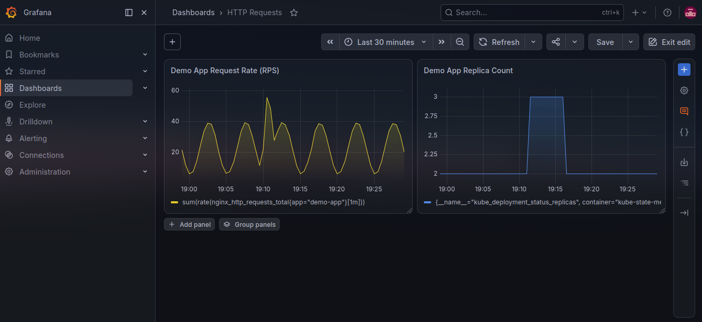
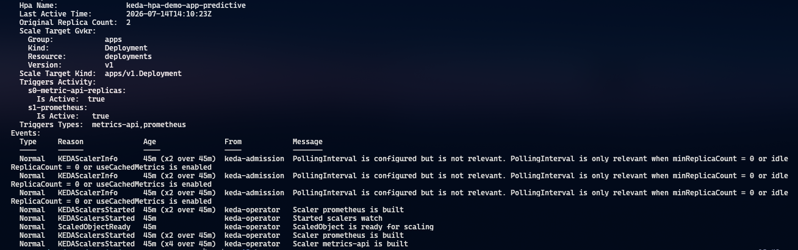
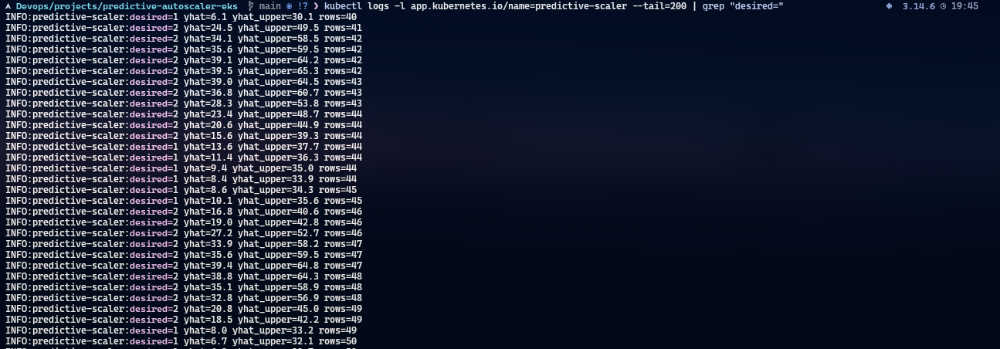

# Predictive K8s Autoscaler with Prophet + KEDA

Proactive Kubernetes autoscaling for AWS EKS. A Prophet forecaster predicts
near-future request load and pre-scales the workload **before** traffic
arrives, while KEDA stays underneath as a reactive safety net. The forecaster
is swappable.

KEDA takes the **max** of the predictive endpoint and a direct Prometheus
trigger, so the forecast is a floor, never a ceiling. If the predictive path
dies, the cluster degrades gracefully to ordinary reactive autoscaling.

---

## Architecture diagram


---

## Screenshots



The replica count (right) steps up in lockstep with the request-rate ramp
(left), then steps back down once traffic falls — proof the deployment is
actually scaling in response to load, live on the cluster.



`kubectl describe hpa` on the KEDA-managed HPA showing both triggers
(`s0-metric-api-replicas` and `s1-prometheus`) reporting `Is Active: true`
proof the predictive endpoint and the Prometheus safety-net trigger are both
wired up and being evaluated by KEDA.



Live logs from the `predictive-scaler` pod showing `desired` replica counts
computed from Prophet's `yhat`/`yhat_upper` forecast on each poll proof the
forecaster is running in-cluster and producing real predictions, not just in
the offline simulation.

---

## Does it actually help?

The offline simulation replays a 4-day per-minute trace with a realistic daily
rhythm, a 4-minute pod cold-start, and one unplanned spike. Scored over the
same post-warmup window:

| scaler                | under-provisioned min | pod-minutes | dropped load |
| --------------------- | --------------------: | ----------: | -----------: |
| reactive HPA          |                    25 |      26,965 |        252.1 |
| predictive (Prophet)  |                     0 |      30,295 |          0.0 |

Predictive scaling eliminated cold-start shortfall on the predictable ramp for
~12% more pod-minutes. That tradeoff is the whole point: spend a little extra
capacity to remove the lag reactive scaling suffers during a ramp.

(Re-running `python -m sim.compare` yourself will land within a few dozen
pod-minutes of the predictive row above, not exactly on it — Prophet's Stan
backend fits via MCMC, which is stochastic run-to-run. `under-provisioned min`
and `dropped load` should stay at `0`/`0.0` consistently; `reactive HPA`'s row
is deterministic and should match exactly.)


The chart shows day 4 of the trace. Reactive capacity (red) repeatedly lags the
load ramp; the shaded area is dropped traffic. Predictive capacity (green) is
already in place before each ramp peaks. The unplanned spike near the right edge
is caught by the reactive KEDA trigger Prophet only forecasts recurring
patterns.

Reproduce the table and chart with **no cluster required**:

```bash
pip install -e .
python -m sim.compare      # writes screenshots/comparison.png
```

### What it does NOT do

Prophet forecasts recurring patterns (daily, weekly). It is blind to genuinely
unplanned events and reacts to those no faster than plain HPA. The live demo
shows this honestly — the reactive KEDA trigger is what catches the surprise
spike.

---

## Tech stack

| Layer          | Technology                              | Purpose                                                  |
| -------------- | --------------------------------------- | -------------------------------------------------------- |
| Infrastructure | AWS EKS, VPC                            | Managed Kubernetes                                       |
| IaC            | Terraform 1.10+, S3 native locking      | Reproducible cluster (no DynamoDB needed)                |
| Forecasting    | Prophet (swappable via `Forecaster`)    | Predicts near-future load; fit-cached on a TTL           |
| Scaling        | KEDA                                    | Predictive `metrics-api` + reactive Prometheus trigger   |
| Service        | Python 3.12 + FastAPI                   | Serves `/desired-replicas` to KEDA                       |
| Observability  | kube-prometheus-stack, Grafana          | Metrics + dashboards                                     |
| Demo workload  | nginx + nginx-prometheus-exporter       | Emits the request-rate metric Prometheus scrapes         |
| Packaging      | Docker (multi-stage, non-root, ROFS)    | Hardened scaler image                                    |
| CI/CD          | GitHub Actions + GHCR                   | Test, run sim, build + push `:latest` and `:<sha>`       |

---

## Prerequisites

You need the tools below installed locally before running anything in this
repo. Each section shows install commands and a verify step with the exact
output to expect.

### 1. AWS CLI v2

Linux:
```bash
curl "https://awscli.amazonaws.com/awscli-exe-linux-x86_64.zip" -o "awscliv2.zip"
unzip awscliv2.zip
sudo ./aws/install
```

macOS (Homebrew):
```bash
brew install awscli
```

Configure credentials and verify:
```bash
aws configure
aws sts get-caller-identity
```

Expected output:
```
{
    "UserId": "AIDAEXAMPLE",
    "Account": "123456789012",
    "Arn": "arn:aws:iam::123456789012:user/your-name"
}
```

**Success indicator:** `Account` shows your 12-digit AWS account ID.

### 2. Terraform >= 1.10

Linux:
```bash
wget -O - https://apt.releases.hashicorp.com/gpg | sudo gpg --dearmor -o /usr/share/keyrings/hashicorp-archive-keyring.gpg
echo "deb [signed-by=/usr/share/keyrings/hashicorp-archive-keyring.gpg] https://apt.releases.hashicorp.com $(lsb_release -cs) main" | sudo tee /etc/apt/sources.list.d/hashicorp.list
sudo apt-get update && sudo apt-get install terraform
```

macOS:
```bash
brew tap hashicorp/tap
brew install hashicorp/tap/terraform
```

Verify:
```bash
terraform --version
```

Expected output:
```
Terraform v1.10.5
```

**Success indicator:** Version is 1.10 or newer. Earlier versions do not support
S3 native state locking (which this repo uses instead of DynamoDB).

### 3. kubectl (pinned to 1.32)

Linux:
```bash
curl -LO "https://dl.k8s.io/release/v1.32.0/bin/linux/amd64/kubectl"
sudo install -o root -g root -m 0755 kubectl /usr/local/bin/kubectl
```

macOS:
```bash
brew install kubernetes-cli
```

Verify:
```bash
kubectl version --client
```

Expected output:
```
Client Version: v1.32.0
Kustomize Version: v5.5.0
```

**Success indicator:** Client version starts with `v1.32`.

### 4. Helm v3

Linux / macOS:
```bash
curl https://raw.githubusercontent.com/helm/helm/main/scripts/get-helm-3 | bash
```

Verify:
```bash
helm version
```

Expected output:
```
version.BuildInfo{Version:"v3.14.4", GitCommit:"...", ...}
```

**Success indicator:** Version is v3.x. (Helm v4 also works for everything
this repo uses — `install`/`upgrade`/`uninstall` — though it's not the
version this README was originally written against.)

### 5. Docker

Linux:
```bash
curl -fsSL https://get.docker.com | sh
sudo usermod -aG docker "$USER"
newgrp docker
```

macOS:
```bash
brew install --cask docker
open -a Docker
```

Verify:
```bash
docker run hello-world
```

**Success indicator:** The Docker daemon prints `Hello from Docker!`. If you
get `Cannot connect to the Docker daemon` even though Docker is installed, the
daemon service isn't running yet — `sudo systemctl start docker` on Linux (and
add yourself to the `docker` group if you don't want to `sudo` every command:
`sudo usermod -aG docker "$USER"`, then start a new shell).

### 6. Python 3.12 (offline simulation only)

The live cluster does not require Python locally — it's only needed to run the
offline simulation and tests.

Linux:
```bash
sudo apt-get install python3.12 python3-pip
```

macOS:
```bash
brew install python@3.12
```

Verify:
```bash
python3 --version
```

Expected output:
```
Python 3.12.x
```

**Success indicator:** Version starts with `3.12`.

### AWS IAM requirements

The IAM principal used for `terraform apply` needs these managed policies:

| Policy                        | Why it's needed                              |
| ----------------------------- | -------------------------------------------- |
| `AmazonEC2FullAccess`         | VPC, subnets, NAT gateways, security groups  |
| `AmazonEKSClusterPolicy`      | EKS control-plane permissions                |
| `IAMFullAccess`               | Create cluster, node, and IRSA roles         |
| `AmazonS3FullAccess`          | Terraform state bucket access                |

Production accounts should narrow these — the policies above are a fast-path
for a fresh dev account.

---

## Deployment — step by step

### Step 1 — Clone the repository

```bash
git clone https://github.com/Abhiram-Rakesh/Predictive-K8s-Autoscaler-Prophet-Keda.git
cd Predictive-K8s-Autoscaler-Prophet-Keda
```

**Success indicator:** `ls` shows `Makefile`, `terraform/`, `helm/`, `core/`,
`service/`, `k8s/`, `scripts/`.

### Step 2 — Run the offline simulation (optional but recommended)

Confirm everything works before spinning up any AWS infrastructure:

```bash
pip install -e ".[test,service]"
python -m pytest tests/ -q
python -m sim.compare
```

Expected output (last lines of pytest):
```
14 passed in 3.12s
```

Expected output of `sim.compare`:
```
scaler                 under-min    pod-min    dropped
reactive HPA                  25     26,965      252.1
predictive (Prophet)           0     30,295        0.0

wrote screenshots/comparison.png
```

**Success indicator:** 14 tests pass and `screenshots/comparison.png` is
updated. If Prophet is missing, `pip install prophet` and retry. The `service`
extra is required even for tests — `tests/test_service_state.py` imports
`service/app.py`, which pulls in `requests`, `fastapi`, and
`prometheus-api-client`.

### Step 3 — Create the Terraform state bucket

Terraform 1.10+ uses
[S3 native state locking](https://developer.hashicorp.com/terraform/language/backend/s3#state-locking)
via conditional writes — no DynamoDB table required.

```bash
export AWS_REGION=ap-south-1
export TF_STATE_BUCKET="my-tf-state-$(aws sts get-caller-identity --query Account --output text)"

aws s3api create-bucket \
  --bucket "$TF_STATE_BUCKET" \
  --region "$AWS_REGION" \
  --create-bucket-configuration LocationConstraint="$AWS_REGION"

aws s3api put-bucket-versioning \
  --bucket "$TF_STATE_BUCKET" \
  --versioning-configuration Status=Enabled

aws s3api put-bucket-encryption \
  --bucket "$TF_STATE_BUCKET" \
  --server-side-encryption-configuration '{"Rules":[{"ApplyServerSideEncryptionByDefault":{"SSEAlgorithm":"AES256"}}]}'

aws s3api put-public-access-block \
  --bucket "$TF_STATE_BUCKET" \
  --public-access-block-configuration BlockPublicAcls=true,IgnorePublicAcls=true,BlockPublicPolicy=true,RestrictPublicBuckets=true
```

Verify:
```bash
aws s3 ls | grep "$TF_STATE_BUCKET"
```

Expected output:
```
2026-05-28 12:00:00 my-tf-state-123456789012
```

**Success indicator:** Bucket appears in `aws s3 ls`.

### Step 4 — Configure and provision infrastructure

Copy and edit the example tfvars:
```bash
cp terraform/terraform.tfvars.example terraform/terraform.tfvars
```

Key variables to review:

| Variable                               | Example          | Notes                                                               |
| -------------------------------------- | ---------------- | ------------------------------------------------------------------- |
| `aws_region`                           | `ap-south-1`     | Match the region from Step 3                                        |
| `cluster_name`                         | `predictive-autoscaler` | Becomes the EKS cluster name                               |
| `cluster_version`                      | `1.32`           | Pin to match your kubectl version                                   |
| `node_instance_type`                   | `t3.large`       | Runs the demo app and the scaler                                    |
| `cluster_endpoint_public_access_cidrs` | `["0.0.0.0/0"]`  | Restrict to your office/VPN CIDR for any non-throwaway cluster      |

Initialize, plan, apply:
```bash
cd terraform
terraform init \
  -backend-config="bucket=${TF_STATE_BUCKET}" \
  -backend-config="region=${AWS_REGION}"

terraform plan -out=tfplan
terraform apply tfplan
cd ..
```

Expected output (last lines of `apply`, resource count varies with module
versions — treat the number as illustrative, not exact):
```
Apply complete! Resources: 56 added, 0 changed, 0 destroyed.

Outputs:

aws_region         = "ap-south-1"
cluster_endpoint   = "https://EXAMPLE.gr7.ap-south-1.eks.amazonaws.com"
cluster_name       = "predictive-autoscaler"
kubeconfig_command = "aws eks update-kubeconfig --region ap-south-1 --name predictive-autoscaler"
vpc_id             = "vpc-EXAMPLE"
```

**Success indicator:** `aws eks list-clusters --region $AWS_REGION` includes
`predictive-autoscaler`.

### Step 5 — Configure kubectl

```bash
make kubeconfig
kubectl get nodes
```

Expected output:
```
NAME                                            STATUS   ROLES    AGE   VERSION
ip-10-0-1-12.ap-south-1.compute.internal        Ready    <none>   3m    v1.32.0-eks-...
ip-10-0-2-45.ap-south-1.compute.internal        Ready    <none>   3m    v1.32.0-eks-...
```

**Success indicator:** All nodes show `STATUS=Ready`.

### Step 6 — Install cluster add-ons

```bash
make addons
```

This installs metrics-server, kube-prometheus-stack (Prometheus + Grafana), and
KEDA in a single step. To install manually:

#### 6a — metrics-server

```bash
kubectl apply -f https://github.com/kubernetes-sigs/metrics-server/releases/latest/download/components.yaml
kubectl top nodes
```

**Success indicator:** `kubectl top nodes` shows non-empty CPU% and MEMORY%.

#### 6b — kube-prometheus-stack

```bash
helm repo add prometheus-community https://prometheus-community.github.io/helm-charts
helm repo update

helm upgrade --install monitoring prometheus-community/kube-prometheus-stack \
  --namespace monitoring --create-namespace \
  --set grafana.adminPassword='admin' \
  --set prometheus.prometheusSpec.serviceMonitorSelectorNilUsesHelmValues=false \
  --wait
```

Verify:
```bash
kubectl get pods -n monitoring
```

Expected output (abbreviated):
```
NAME                                                     READY   STATUS    RESTARTS   AGE
alertmanager-monitoring-kube-prometheus-alertmanager-0   2/2     Running   0          2m
monitoring-grafana-78d9b9f786-2xkp4                      3/3     Running   0          2m
monitoring-kube-prometheus-operator-...                  1/1     Running   0          2m
prometheus-monitoring-kube-prometheus-prometheus-0       2/2     Running   0          2m
```

**Success indicator:** All monitoring pods are `Running` with no `RESTARTS`.

#### 6c — KEDA

```bash
helm repo add kedacore https://kedacore.github.io/charts
helm repo update

helm upgrade --install keda kedacore/keda \
  --namespace keda --create-namespace \
  --wait
```

Verify:
```bash
kubectl get pods -n keda
```

**Success indicator:** All KEDA pods are `Running`. You'll see a startup
warning that KEDA is "running on unsupported Kubernetes version 1.32" (KEDA's
tested baseline is 1.33+) — this is a soft warning, not a failure; the chart
installs and functions normally on this repo's default cluster version.

### Step 7 — Build and push the scaler image

CI publishes both `:latest` and `:<git-sha>` on every push to main. The job
summary surfaces the pinned tag — use that for any non-throwaway deploy. To
build locally:

```bash
docker build -t ghcr.io/<owner>/predictive-scaler:latest .
docker push ghcr.io/<owner>/predictive-scaler:latest
```

`<owner>` must be lowercase — Docker/GHCR reject mixed-case repository names
outright (`repository name must be lowercase`). If your GitHub username has
uppercase letters, lowercase it in the tag even though the account itself
doesn't need to change.

Expected output (last lines):
```
latest: digest: sha256:abc123... size: 1234
```

**Success indicator:** Image appears in your GHCR package list.

### Step 8 — Deploy the demo

```bash
# Demo (uses :latest):
make deploy

# Production-style (pinned SHA from CI job summary):
./scripts/deploy.sh ghcr.io/<owner>/predictive-scaler:<git-sha>
```

This deploys the demo app, load generator, ServiceMonitor, and the predictive
scaler Helm chart (which creates the Deployment, KEDA ScaledObject,
PodDisruptionBudget, and NetworkPolicy).

Verify:
```bash
kubectl get pods
kubectl get scaledobject
```

Expected output:
```
NAME                           READY   STATUS    RESTARTS   AGE
demo-app-...                   1/1     Running   0          60s
predictive-scaler-...          1/1     Running   0          60s
predictive-scaler-...          1/1     Running   0          60s

NAME                          SCALETARGETKIND      SCALETARGETNAME   MIN   MAX   READY   ACTIVE
demo-app-predictive           Deployment           demo-app          1     20    True    True
```

**Success indicator:** Both `predictive-scaler` pods are `Running` and the
ScaledObject shows `READY=True`.

Confirm the scaler is serving replica decisions:
```bash
kubectl port-forward svc/predictive-scaler 8080:8080 &
sleep 2
curl http://localhost:8080/desired-replicas
kill %1 2>/dev/null
```

Expected response:
```json
{"replicas": 2, "yhat": 45.3, "yhat_upper": 61.8}
```

**Success indicator:** JSON response with an integer `replicas` field and no
`error` key.

### Step 9 — Run the guided demo

```bash
make demo                # narrates the scaling behaviour
make port-forward        # Grafana :3000 (admin/admin), Prometheus :9090
```

The demo script runs in phases:

1. **Cluster health check** — verifies all nodes and both scaler pods are
   `Running`.
2. **Baseline** — prints current replica count and the active forecast values.
3. **Load ramp** — the load generator starts a gradual traffic increase.
   Watch `demo-app` replicas rise **ahead** of the ramp.
4. **Spike injection** — injects an unplanned traffic spike. The predictive
   line does not anticipate it; the reactive KEDA trigger catches it.
5. **Scale-down** — load drops; replicas shed one step at a time (controlled
   by `max_scale_down_step=1` in the planner).
6. **Summary** — prints decision log from the scaler's `/metrics` endpoint.

Capture screenshots during phases 3 and 4 and drop them in `screenshots/`.

---

## Configuration reference

The scaler is tuned via Helm values (`helm/predictive-scaler/values.yaml`),
passed to the service as env vars:

| Helm value                        | Env var                    | Default                             | Description                                          |
| --------------------------------- | -------------------------- | ----------------------------------- | ---------------------------------------------------- |
| `scaler.forecaster`               | `FORECASTER`               | `prophet`                           | `prophet` (graduated + cached) or `naive`            |
| `scaler.capacityPerPod`           | `CAPACITY_PER_POD`         | `50`                                | Load one pod serves (req/s)                          |
| `scaler.headroom`                 | `HEADROOM`                 | `0.3`                               | Safety buffer on top of `yhat_upper`                 |
| `scaler.minReplicas`              | `MIN_REPLICAS`             | `1`                                 | Hard floor                                           |
| `scaler.maxReplicas`              | `MAX_REPLICAS`             | `20`                                | Hard ceiling                                         |
| `scaler.horizonMin`               | `HORIZON_MIN`              | `10`                                | Minutes ahead to forecast                            |
| `scaler.refitAfterSec`            | `REFIT_AFTER_SEC`          | `180`                               | Prophet refit cadence (cache TTL in seconds)         |
| `scaler.graduateAtRows`           | `GRADUATE_AT_ROWS`         | `1440`                              | Switch from `SeasonalNaive` to Prophet at N rows     |
| `scaler.prometheusTimeoutSec`     | `PROMETHEUS_TIMEOUT_SEC`   | `5`                                 | Per-request Prometheus timeout                       |
| `scaler.historyWindow`            | `HISTORY_WINDOW`           | `2880`                              | Minutes of history fed to the forecaster             |
| `scaler.stateFilePath`            | `STATE_FILE_PATH`          | `/tmp/predictive-scaler-state.json` | Persistence path (emptyDir); survives container restart, not pod reschedule |
| `scaler.prometheusUrl`            | `PROMETHEUS_URL`           | *(in-cluster address)*              | Prometheus endpoint                                  |
| `scaler.prometheusQuery`          | `PROMETHEUS_QUERY`         | `sum(rate(nginx_http_requests_total{app="demo-app"}[1m]))` | PromQL query for request rate |
| `reactive.threshold`              | —                          | `35`                                | Reactive trigger RPS threshold (KEDA Prometheus trigger) |
| `networkPolicy.enabled`           | —                          | `true`                              | Requires an enforcing CNI — see caveats below        |

Swap the forecaster by implementing a single `predict` method on the
`Forecaster` protocol in `core/forecaster.py`.

---

## Observability

| Source | What it covers | How to access |
| ------ | -------------- | ------------- |
| `/metrics` endpoint | Last computed replica count + forecast upper bound as Prometheus gauges | `curl http://predictive-scaler:8080/metrics` |
| `/desired-replicas` endpoint | Live forecast JSON: `replicas`, `yhat`, `yhat_upper` | `kubectl port-forward svc/predictive-scaler 8080:8080` |
| Scaler pod logs | Every decision: `desired=N yhat=X.X yhat_upper=Y.Y rows=Z` | `kubectl logs -l app.kubernetes.io/name=predictive-scaler -f` |
| Grafana | kube-prometheus-stack dashboards — pod counts, CPU, request rate | `http://localhost:3000` after `make port-forward` |
| Prometheus | Raw metrics + the demo-app request rate driving the scaler | `http://localhost:9090` after `make port-forward` |

---

## AWS cost estimate

| Service                       | Spin-up session (~1 hr) | Always-on (24×7) | Notes                                |
| ----------------------------- | ----------------------: | ---------------: | ------------------------------------ |
| EKS control plane             |                   $0.10 |        ~$73 / mo | $0.10/hr regardless of node count    |
| EC2 nodes (`t3.large` × 2)   |                   $0.16 |       ~$116 / mo | On-demand                            |
| NAT Gateway (×1)              |                   $0.05 |        ~$33 / mo | Plus small per-GB data charges       |
| **Total**                     |           **~$0.30/hr** |     **~$222/mo** | See Teardown to stop billing         |

Run `make cluster-down` when done. Set a billing alarm — a forgotten cluster
is the classic surprise bill.

---

## Day-2 operations

### Open all service UIs

```bash
make port-forward
```

| Service    | URL                       | Credentials |
| ---------- | ------------------------- | ----------- |
| Grafana    | `http://localhost:3000`   | admin / admin |
| Prometheus | `http://localhost:9090`   | — |
| Scaler API | `http://localhost:8080`   | — |

Press `Ctrl-C` to stop all tunnels.

### Check live forecast

```bash
kubectl port-forward svc/predictive-scaler 8080:8080 &
sleep 2
curl -s http://localhost:8080/desired-replicas | jq
kill %1 2>/dev/null
```

### Watch scaling decisions in real time

```bash
kubectl logs -l app.kubernetes.io/name=predictive-scaler -f --max-log-requests=2
```

Each line shows the decision, forecast point, upper bound, and the number of
history rows fed to the model:

```
INFO desired=4 yhat=178.3 yhat_upper=221.6 rows=1440
```

### Switch forecaster to SeasonalNaive (instant, no refit cost)

```bash
helm upgrade predictive-scaler helm/predictive-scaler/ \
  --reuse-values \
  --set scaler.forecaster=naive
```

Switch back:
```bash
helm upgrade predictive-scaler helm/predictive-scaler/ \
  --reuse-values \
  --set scaler.forecaster=prophet
```

### Tune the refit cadence

```bash
helm upgrade predictive-scaler helm/predictive-scaler/ \
  --reuse-values \
  --set scaler.refitAfterSec=300   # refit every 5 minutes instead of 3
```

### Rolling restart the scaler

```bash
kubectl rollout restart deployment/predictive-scaler
kubectl rollout status deployment/predictive-scaler
```

---

## Troubleshooting

### 1. KEDA not scaling — ScaledObject shows `READY=False`

Symptom:
```
NAME                    READY   ACTIVE
demo-app-predictive     False   False
```

Diagnosis:
```bash
kubectl describe scaledobject demo-app-predictive
kubectl get events --field-selector reason=KEDAScalerFailed
```

Most common cause: the scaler pods are not yet ready or `/desired-replicas` is
returning an error. Check pod status and logs:

```bash
kubectl get pods -l app.kubernetes.io/name=predictive-scaler
kubectl logs -l app.kubernetes.io/name=predictive-scaler --tail=50
```

Fix: if logs show `forecast failed`, Prometheus is likely unreachable. Verify
the URL in Helm values matches the in-cluster Prometheus service address.

**Success indicator:** `kubectl get scaledobject` shows `READY=True`.

### 2. Scaler stuck at `minReplicas` on a fresh cluster

Symptom: `/desired-replicas` always returns `{"replicas": 1}` even under load.

Diagnosis:
```bash
curl -s http://localhost:8080/desired-replicas | jq
kubectl logs -l app.kubernetes.io/name=predictive-scaler --tail=20
```

Expected log during warmup:
```
INFO desired=1 yhat=0.0 yhat_upper=0.0 rows=12
```

This is expected behaviour. `GraduatedForecaster` uses `SeasonalNaive` until
`GRADUATE_AT_ROWS` (default 1440) rows of Prometheus history accumulate — about
24 hours on a fresh cluster. `SeasonalNaive` needs a full season of data (1440
minutes for daily seasonality) before its forecasts are meaningful; until then
it returns a low estimate that keeps replicas at the floor.

The reactive KEDA Prometheus trigger is active the entire time and will scale
under real load regardless. The predictive path is additive.

**Success indicator:** After ~24 hours (or after lowering `GRADUATE_AT_ROWS`
for testing), log lines show `rows` at or above the threshold and `yhat` values
matching the request rate.

### 3. Prometheus returning no data — `RuntimeError: Prometheus returned no data`

Symptom: scaler log shows:
```
WARNING forecast failed (Prometheus returned no data for query); holding last replicas=2
```

Diagnosis:
```bash
# Verify Prometheus is reachable from within the cluster
kubectl run -it --rm debug --image=curlimages/curl --restart=Never -- \
  curl -s "http://monitoring-kube-prometheus-prometheus.monitoring.svc:9090/api/v1/query?query=up"

# Confirm the ServiceMonitor is picked up
kubectl get servicemonitor -n default
```

Fix: if the ServiceMonitor exists but Prometheus shows no targets, the
kube-prometheus-stack was installed without `serviceMonitorSelectorNilUsesHelmValues=false`.
Upgrade the release:

```bash
helm upgrade monitoring prometheus-community/kube-prometheus-stack \
  --namespace monitoring --reuse-values \
  --set prometheus.prometheusSpec.serviceMonitorSelectorNilUsesHelmValues=false
```

**Success indicator:** Log lines no longer show `forecast failed`; `yhat_upper`
is non-zero.

### 4. Scaler pod `CrashLoopBackOff` — import error

Symptom:
```
NAME                            READY   STATUS             RESTARTS
predictive-scaler-abc123-xyz    0/1     CrashLoopBackOff   3
```

Diagnosis:
```bash
kubectl logs -l app.kubernetes.io/name=predictive-scaler --previous
```

If you see `ModuleNotFoundError: No module named 'core'`, the image was built
from an old Dockerfile that only copied `service/`. Rebuild from the current
Dockerfile (which copies `core/` and `sim/` and installs the project package):

```bash
docker build -t ghcr.io/<owner>/predictive-scaler:latest .
docker push ghcr.io/<owner>/predictive-scaler:latest
kubectl rollout restart deployment/predictive-scaler
```

**Success indicator:** Pod reaches `Running` and logs show
`forecaster=prophet (cached, ...)`.

### 5. NetworkPolicy blocking KEDA — `/desired-replicas` timeouts

Symptom: KEDA events show `context deadline exceeded` or connection refused, but
`curl` from within the same namespace works fine.

Diagnosis:
```bash
kubectl describe networkpolicy predictive-scaler
# Check KEDA namespace label
kubectl get namespace keda --show-labels
```

The NetworkPolicy allows ingress only from namespaces labelled
`kubernetes.io/metadata.name=keda`. EKS applies this label automatically, but
confirm it's present:

```bash
kubectl get namespace keda -o jsonpath='{.metadata.labels}'
```

If the label is missing:
```bash
kubectl label namespace keda kubernetes.io/metadata.name=keda
```

If your CNI does not enforce NetworkPolicies (EKS default VPC CNI without the
network-policy add-on), the policy is silently a no-op — disable it rather
than debugging a non-enforced policy:

```bash
helm upgrade predictive-scaler helm/predictive-scaler/ \
  --reuse-values \
  --set networkPolicy.enabled=false
```

**Success indicator:** KEDA ScaledObject shows `READY=True` and
`/desired-replicas` responds within 1s.

### 6. Prophet refit taking too long — KEDA timeouts during refit window

Symptom: every ~3 minutes (the refit TTL), KEDA receives a slow response and
logs a metrics fetch warning.

Diagnosis:
```bash
kubectl top pod -l app.kubernetes.io/name=predictive-scaler
```

If CPU is consistently at the 1000m limit during refits, Stan is being throttled
by the cgroup. Increase the CPU limit or shorten the history window:

```bash
helm upgrade predictive-scaler helm/predictive-scaler/ \
  --reuse-values \
  --set resources.limits.cpu=2000m

# Or reduce history to reduce fit time (fewer rows = faster Stan):
helm upgrade predictive-scaler helm/predictive-scaler/ \
  --reuse-values \
  --set scaler.historyWindow=1440
```

**Success indicator:** `kubectl top pod` shows CPU usage dropping back below
the limit between refit windows.

### 7. Pods can't reach each other across nodes — Service/pod-IP connections time out

Symptom: a pod on one node can reach a Service or pod IP on the *same* node
fine, but connections to a pod scheduled on a *different* node hang and time
out (no `Connection refused`, just silence). This shows up as, e.g., the load
generator never producing any measurable RPS even though it's running, or
Prometheus showing no scrape data for a target on another node.

Diagnosis — same-node vs cross-node is the tell:
```bash
# From a pod, connect directly to another pod's IP (bypasses Services/kube-proxy)
kubectl exec -it <pod> -- python3 -c "
import socket
s = socket.socket(socket.AF_INET, socket.SOCK_STREAM); s.settimeout(3)
s.connect(('<other-pod-ip>', <port>))
print('connected')
"
```
If this hangs only when the two pods are on different nodes (`kubectl get pods
-o wide` to check), it's a security group issue, not a Kubernetes networking
issue.

Root cause: the `terraform-aws-modules/eks` module's default node security
group only opens node-to-node traffic on ephemeral ports (1025-65535) plus DNS
(53) and the control-plane webhook ports. Application ports below 1025 (nginx
on 80, Prometheus on 9090, etc.) are never opened between nodes unless you add
a rule for it. This repo's `terraform/main.tf` sets
`node_security_group_additional_rules` with a self-referencing all-ports
ingress rule specifically to cover this — if you see this symptom, check that
rule wasn't removed or narrowed:

```bash
terraform -chdir=terraform state show 'module.eks.aws_security_group_rule.node["ingress_self_all"]'
```

**Success indicator:** the same-node vs cross-node connect test above succeeds
in both cases.

---

## Teardown

```bash
make cluster-down        # ./scripts/teardown.sh
```

The script runs in this order:

1. **Uninstall Helm releases** (`predictive-scaler`, `monitoring`, `keda`).
   This triggers KEDA and any LoadBalancer services to release their AWS ELBs.
2. **Delete namespaces** (`monitoring`, `keda`). Removes remaining workloads
   and PVCs.
3. **Wait 60 seconds** for AWS to detach and delete ENIs from the private
   subnets.
4. **`terraform destroy`**. Deletes the VPC, subnets, NAT gateway, and EKS
   cluster.

**Why this order matters:** Terraform cannot delete a VPC while any ENI lives
in one of its subnets. Running `terraform destroy` directly without first
cleaning up LoadBalancers will retry for 15+ minutes and then fail. Steps 1–3
ensure the subnets are clean before step 4 runs.

If `terraform destroy` still fails, list and delete any remaining load balancers
manually:

```bash
VPC_ID=$(terraform -chdir=terraform output -raw vpc_id)
aws elbv2 describe-load-balancers --region "$AWS_REGION" \
  --query "LoadBalancers[?VpcId=='${VPC_ID}'].LoadBalancerArn" --output text

aws elbv2 delete-load-balancer --region "$AWS_REGION" --load-balancer-arn <ARN>
sleep 60
terraform -chdir=terraform destroy
```

