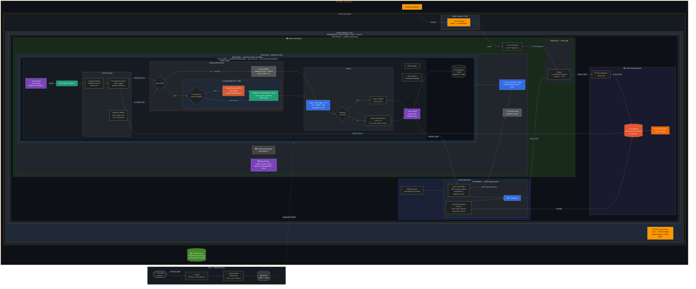

```mermaid
%%{init: {
  'theme': 'dark',
  'themeVariables': {
    'background': '#0d1117',
    'primaryColor': '#1f2937',
    'primaryTextColor': '#f0f6fc',
    'primaryBorderColor': '#FF9900',
    'lineColor': '#8b949e',
    'secondaryColor': '#161b22',
    'tertiaryColor': '#21262d',
    'clusterBkg': '#161b22',
    'clusterBorder': '#30363d',
    'edgeLabelBackground': '#1f2937',
    'fontFamily': 'monospace'
  }
}}%%

graph LR

    %% ── Developer / CI ────────────────────────────────────────────────────
    subgraph ci ["⚙️  CI — GitHub Actions"]
        direction TB
        DEV(["👨‍💻 Developer\ngit push"])
        TEST["🧪 pytest\n14 tests + sim.compare"]
        BUILD["🐳 docker build\nmulti-stage\ncore + sim + service"]
        GHCR[("📦 GHCR\n:latest + :&lt;sha&gt;")]
        DEV --> TEST --> BUILD --> GHCR
    end

    %% ── AWS Infrastructure ────────────────────────────────────────────────
    subgraph aws ["☁️  AWS — ap-south-1"]
        direction TB

        S3[("🪣 S3 State Bucket\nTerraform native locking\nno DynamoDB needed")]
        IGW["🌐 Internet Gateway"]

        subgraph vpc ["🔲 VPC  10.0.0.0/16"]
            direction TB

            subgraph pub ["Public Subnets ×2 AZs"]
                NAT["🔀 NAT Gateway\nsingle — cost optimised"]
            end

            subgraph priv ["Private Subnets ×2 AZs"]
                EKS_CP["⚙️  EKS Control Plane\nv1.32 — AWS managed\npublic endpoint + CIDR guard"]

                subgraph ng ["Managed Node Group  t3.large ×2  (min 2 · max 5)"]

                    subgraph cluster ["🔷 EKS Cluster — predictive-autoscaler"]
                        direction LR

                        %% ── monitoring namespace ──────────────────────────
                        subgraph mon_ns ["📊 monitoring namespace"]
                            direction TB
                            PROM[("🔥 Prometheus\nkube-prometheus-stack\nscrape: 60s")]
                            GRAF["📈 Grafana :3000\nadmin / admin"]
                            SM["🔍 ServiceMonitor\ndemo-app"]
                            PROM --> GRAF
                            SM -->|scrape :9113| PROM
                        end

                        %% ── keda namespace ────────────────────────────────
                        subgraph keda_ns ["⚡ keda namespace"]
                            direction TB
                            KEDA_OP["KEDA Operator\nScaledObject controller"]
                            subgraph so ["ScaledObject — demo-app-predictive"]
                                direction TB
                                T1["metrics-api trigger\nGET /desired-replicas\ntargetValue: 1\npollInterval: 15s"]
                                T2["prometheus trigger\nsum rate nginx_http_requests\nthreshold: 35 RPS"]
                                MAX["MAX of triggers"]
                                T1 --> MAX
                                T2 --> MAX
                            end
                            KEDA_OP --> so
                        end

                        %% ── default namespace ─────────────────────────────
                        subgraph def_ns ["🟩 default namespace"]
                            direction TB

                            LG["🔁 Load Generator\nlocust / loadgen.py"]

                            subgraph demo_deploy ["Deployment — demo-app"]
                                DEMO["🌐 nginx\n+ prometheus-exporter\nscales 1 → 20"]
                            end

                            subgraph scaler_k8s ["Kubernetes — predictive-scaler"]
                                direction TB
                                SVC["🔀 Service ClusterIP :8080\nload-balances across 2 pods"]
                                PDB["🛡️  PodDisruptionBudget\nminAvailable: 1"]
                                NP["🔒 NetworkPolicy\ningress: keda ns only\negress: monitoring:9090 + DNS"]
                                SA["🪪 ServiceAccount\npredictive-scaler"]

                                subgraph scaler_deploy ["Deployment — predictive-scaler  ×2 replicas"]
                                    direction TB

                                    subgraph pod_sec ["Pod  uid:10001 · readOnlyRootFilesystem · caps: drop ALL · seccomp: RuntimeDefault"]
                                        direction LR

                                        EMPTYDIR[("/tmp emptyDir\n64Mi\nstate.json + Stan")]

                                        subgraph svc_app ["FastAPI :8080"]
                                            direction TB

                                            EP["GET /desired-replicas"]
                                            HEALTH["GET /healthz"]
                                            METRICS_EP["GET /metrics\nPrometheus gauges"]

                                            subgraph fetch ["_fetch_history()"]
                                                direction TB
                                                SESSION["requests.Session\nmodule-level pool\ntimeout: 5s"]
                                                PROM_CLI["PrometheusConnect\nquery_range\nwindow: 2880 min"]
                                                SYN["Synthetic fallback\nmake_daily_trace\ndev / offline only"]
                                                SESSION --> PROM_CLI
                                            end

                                            subgraph grad ["GraduatedForecaster"]
                                                direction TB
                                                GATE{rows ≥ 1440?}
                                                NAIVE["SeasonalNaive\nlookback: period − horizon\nupper: point + 2σ"]

                                                subgraph cp ["CachedProphet  TTL: 180s"]
                                                    direction TB
                                                    CC{TTL expired or\nlength changed?}
                                                    FIT["ProphetForecaster.fit()\nStan MCMC\ncached model stored"]
                                                    PRD["ProphetForecaster.predict_with()\nmake_future_dataframe\nmilliseconds"]
                                                    CC -->|refit| FIT --> PRD
                                                    CC -->|cache valid| PRD
                                                end

                                                GATE -->|no — warmup| NAIVE
                                                GATE -->|yes| CC
                                            end

                                            subgraph plan ["Planner"]
                                                direction TB
                                                CALC["target = yhat_upper × 1.3\nraw = ⌈target ÷ 50⌉\nclamp(raw, 1, 20)"]
                                                SU{clamped\n≥ current?}
                                                UP["return clamped\nscale up free"]
                                                DN["return max(clamped, current−1)\nmax_scale_down_step=1"]
                                                CALC --> SU
                                                SU -->|yes| UP
                                                SU -->|no| DN
                                            end

                                            STATE_L["_load_state()\non pod start\nfallback: minReplicas"]
                                            STATE_S["_save_state()\natomic write\n/tmp/state.json"]

                                            EP --> fetch
                                            PROM_CLI -->|DataFrame ds,y| GATE
                                            SYN -.->|no PROM_URL| GATE
                                            NAIVE --> CALC
                                            PRD --> CALC
                                            UP --> STATE_S
                                            DN --> STATE_S
                                            STATE_L -.->|restore| EP
                                        end

                                        STATE_S --- EMPTYDIR
                                    end
                                end

                                SVC --> scaler_deploy
                                PDB -.- scaler_deploy
                                NP -.- scaler_deploy
                            end
                        end
                    end
                end
            end
        end
    end

    %% ── Cross-boundary flows ──────────────────────────────────────────────

    IGW -->|inbound| NAT
    NAT -->|routes| LG
    LG -->|HTTP requests| DEMO
    DEMO -->|metrics :9113| SM

    PROM_CLI -->|cluster-internal| PROM

    T1 -->|GET /desired-replicas| SVC
    T2 -->|PromQL| PROM
    STATE_S -->|replicas + yhat| T1
    MAX -->|replica count| demo_deploy

    GHCR -.->|image pull via NAT| scaler_deploy
    DEV -.->|terraform apply| S3

    %% ── Styles ────────────────────────────────────────────────────────────

    style ci fill:#161b22,stroke:#238636,color:#f0f6fc
    style aws fill:#0d1117,stroke:#FF9900,color:#FF9900
    style vpc fill:#161b22,stroke:#FF9900,color:#f0f6fc
    style pub fill:#1f2937,stroke:#FF9900,color:#f0f6fc
    style priv fill:#1f2937,stroke:#FF9900,color:#f0f6fc
    style ng fill:#21262d,stroke:#FF9900,color:#f0f6fc
    style cluster fill:#0d1117,stroke:#326CE5,color:#f0f6fc
    style mon_ns fill:#1a1a2e,stroke:#E6522C,color:#f0f6fc
    style keda_ns fill:#1a2035,stroke:#326CE5,color:#f0f6fc
    style so fill:#21262d,stroke:#326CE5,color:#f0f6fc
    style def_ns fill:#1a2a1a,stroke:#238636,color:#f0f6fc
    style scaler_k8s fill:#21262d,stroke:#238636,color:#f0f6fc
    style scaler_deploy fill:#1f2937,stroke:#1D9E75,color:#f0f6fc
    style pod_sec fill:#0d1117,stroke:#7B42BC,color:#f0f6fc
    style svc_app fill:#161b22,stroke:#1D9E75,color:#f0f6fc
    style fetch fill:#21262d,stroke:#8b949e,color:#f0f6fc
    style grad fill:#21262d,stroke:#D85A30,color:#f0f6fc
    style cp fill:#1f2937,stroke:#D85A30,color:#f0f6fc
    style plan fill:#21262d,stroke:#326CE5,color:#f0f6fc
    style demo_deploy fill:#21262d,stroke:#444,color:#f0f6fc

    style EP fill:#1D9E75,color:#fff
    style FIT fill:#D85A30,color:#fff
    style PRD fill:#1D9E75,color:#fff
    style NAIVE fill:#555,color:#fff
    style CALC fill:#326CE5,color:#fff
    style MAX fill:#326CE5,color:#fff
    style PDB fill:#444,color:#fff
    style NP fill:#7B42BC,color:#fff
    style STATE_S fill:#7B42BC,color:#fff
    style STATE_L fill:#7B42BC,color:#fff
    style NAT fill:#FF9900,color:#000
    style IGW fill:#FF9900,color:#000
    style S3 fill:#3F8624,color:#fff
    style GHCR fill:#333,color:#fff
    style PROM fill:#E6522C,color:#fff
    style GRAF fill:#F46800,color:#fff
    style SVC fill:#326CE5,color:#fff
    style SA fill:#555,color:#fff
    style EKS_CP fill:#FF9900,color:#000
```
