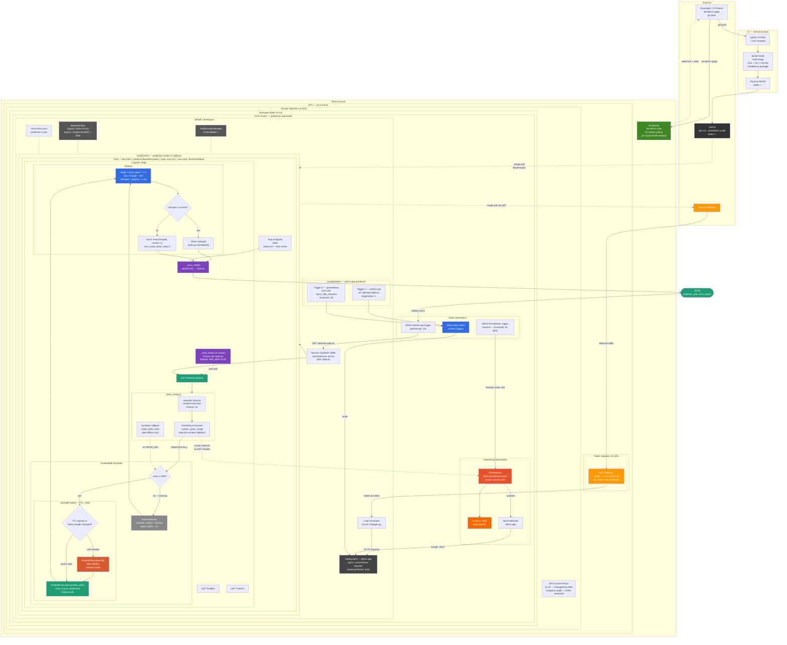

```mermaid
graph TD

    %% ── External ──────────────────────────────────────────────────────────
    subgraph external ["External"]
        IGW["Internet Gateway"]
        GHCR["GHCR\nghcr.io/.../predictive-scaler\n:latest + :<git-sha>"]
        DEV["Developer / CI Runner\nterraform apply\ngit push"]
    end

    %% ── CI / Image supply chain ───────────────────────────────────────────
    subgraph ci ["CI — GitHub Actions"]
        TEST["pytest 14 tests\n+ sim.compare"]
        BUILD["docker build\nmulti-stage\ncore + sim + service\ninstalled as package"]
        PUSH["Push to GHCR\n:latest + :<git-sha>"]
    end

    %% ── AWS Account ───────────────────────────────────────────────────────
    subgraph aws ["AWS Account"]

        S3["S3 Bucket\nTerraform state\nS3 native locking\n(no DynamoDB needed)"]

        subgraph vpc ["VPC — 10.0.0.0/16"]

            subgraph public_subnets ["Public Subnets (×2 AZs)"]
                NAT["NAT Gateway\nsingle — cost optimised\ntag: kubernetes.io/role/elb"]
            end

            subgraph private_subnets ["Private Subnets (×2 AZs)"]

                subgraph eks_cp ["EKS Control Plane\nv1.32 — managed by AWS\nendpoint: public + CIDR-restricted"]
                end

                subgraph node_group ["Managed Node Group\nt3.large × 2 (min=2, max=5)"]

                    subgraph eks ["EKS Cluster — predictive-autoscaler"]

                        subgraph keda_ns ["keda namespace"]
                            KEDA_POLL["KEDA metrics-api trigger\npollInterval: 15s"]
                            PROM_TRIGGER["KEDA Prometheus trigger\nreactive — threshold: 35 RPS"]
                            MAX_LOGIC["KEDA takes MAX\nof both triggers"]
                        end

                        subgraph monitoring_ns ["monitoring namespace"]
                            PROM["Prometheus\nkube-prometheus-stack\nscrape interval: 60s"]
                            GRAF["Grafana :3000\nadmin/admin"]
                            SM["ServiceMonitor\ndemo-app"]
                        end

                        subgraph default_ns ["default namespace"]

                            subgraph scaler_deploy ["Deployment — predictive-scaler (2 replicas)"]

                                subgraph pod ["Pod — uid:10001 | readOnlyRootFilesystem | caps: drop ALL | seccomp: RuntimeDefault"]

                                    subgraph service ["FastAPI :8080"]

                                        EP["GET /desired-replicas"]
                                        HEALTH["GET /healthz"]
                                        METRICS["GET /metrics"]

                                        subgraph fetch ["_fetch_history()"]
                                            SESSION["requests.Session\nmodule-level pool\ntimeout: 5s"]
                                            PROM_CLIENT["PrometheusConnect\ncustom_query_range\nstep:60s window:2880min"]
                                            SYNTHETIC["Synthetic fallback\nmake_daily_trace\n(dev/offline only)"]
                                        end

                                        subgraph forecaster ["GraduatedForecaster"]
                                            GATE{rows ≥ 1440?}
                                            NAIVE["SeasonalNaive\nlookback: period − horizon\nupper: point + 2σ"]
                                            subgraph cached ["CachedProphet — TTL: 180s"]
                                                CACHE_CHECK{TTL expired or\nhistory length changed?}
                                                FIT["ProphetForecaster.fit()\nStan MCMC\ncached model"]
                                                PRED["ProphetForecaster.predict_with()\nmake_future_dataframe\nmilliseconds"]
                                            end
                                        end

                                        subgraph planner ["Planner"]
                                            CALC["target = yhat_upper × 1.3\nraw = ⌈target ÷ 50⌉\nclamped = clip(raw, 1, 20)"]
                                            SCALEUP{clamped ≥ current?}
                                            UP["return clamped\nscale up immediately"]
                                            DOWN["return max(clamped, current−1)\nmax_scale_down_step=1"]
                                        end

                                        STATE_LOAD["_load_state() on startup\nrestore last replicas\nfallback: MIN_REPLICAS"]
                                        STATE_SAVE["_save_state()\natomic tmp → replace"]
                                    end

                                    EMPTYDIR["/tmp emptyDir\n64Mi\nstate.json + Stan writes"]
                                end
                            end

                            PDB["PodDisruptionBudget\nminAvailable: 1"]
                            NP["NetworkPolicy\ningress: keda ns only\negress: monitoring:9090 + DNS"]
                            SVC["Service ClusterIP :8080\nload-balances across\nboth replicas"]
                            SA["ServiceAccount\npredictive-scaler"]

                            subgraph scaledobject ["ScaledObject — demo-app-predictive"]
                                T1["Trigger 1 — metrics-api\nurl: /desired-replicas\ntargetValue: 1"]
                                T2["Trigger 2 — prometheus\nsum rate nginx_http_requests\nthreshold: 35"]
                            end

                            DEMO["Deployment — demo-app\nnginx + prometheus-exporter\ncooldownPeriod: 120s"]
                            LG["Load Generator\nlocust / loadgen.py"]
                        end
                    end
                end
            end
        end
    end

    %% ── Flows ─────────────────────────────────────────────────────────────

    %% CI pipeline
    TEST --> BUILD --> PUSH
    DEV -->|git push| TEST
    PUSH --> GHCR
    GHCR -.->|image pull\nIfNotPresent| scaler_deploy

    %% Terraform state
    DEV -->|terraform apply| S3
    S3 -.->|state lock + read| DEV

    %% Traffic path
    IGW -->|inbound traffic| NAT
    NAT -->|routes to nodes| LG
    LG -->|HTTP requests| DEMO

    %% Metrics path
    SM -->|scrape :9113| DEMO
    PROM -->|watches| SM
    PROM --> GRAF

    %% Predictive path
    SESSION --> PROM_CLIENT
    PROM_CLIENT -->|DataFrame ds,y| GATE
    SYNTHETIC -.->|no PROM_URL| GATE
    GATE -->|no — warmup| NAIVE
    GATE -->|yes| CACHE_CHECK
    CACHE_CHECK -->|refit needed| FIT --> PRED
    CACHE_CHECK -->|cache valid| PRED
    NAIVE --> CALC
    PRED --> CALC
    CALC --> SCALEUP
    SCALEUP -->|yes| UP --> STATE_SAVE
    SCALEUP -->|no| DOWN --> STATE_SAVE
    STATE_LOAD -.->|pod start| EP
    EP --> fetch
    SERVICE_RESPONSE(["JSON\n{replicas, yhat, yhat_upper}"])
    STATE_SAVE --> SERVICE_RESPONSE

    %% KEDA polling
    KEDA_POLL -->|GET /desired-replicas| SVC
    SVC --> EP
    PROM_TRIGGER -->|PromQL every 15s| PROM
    SERVICE_RESPONSE -->|replica count| KEDA_POLL
    T1 --> MAX_LOGIC
    T2 --> MAX_LOGIC
    MAX_LOGIC -->|scale| DEMO

    %% k8s resource relationships
    SVC --> scaler_deploy
    PDB -.- scaler_deploy
    NP -.- scaler_deploy
    SA -.- scaler_deploy
    EMPTYDIR --- STATE_SAVE

    %% Outbound from nodes via NAT
    PROM_CLIENT -.->|cluster-internal\nno NAT needed| PROM
    scaler_deploy -.->|image pull via NAT| IGW

    style EP fill:#1D9E75,color:#fff
    style FIT fill:#D85A30,color:#fff
    style PRED fill:#1D9E75,color:#fff
    style NAIVE fill:#888,color:#fff
    style CALC fill:#326CE5,color:#fff
    style MAX_LOGIC fill:#326CE5,color:#fff
    style PDB fill:#555,color:#fff
    style NP fill:#555,color:#fff
    style STATE_SAVE fill:#7B42BC,color:#fff
    style STATE_LOAD fill:#7B42BC,color:#fff
    style DEMO fill:#444,color:#fff
    style NAT fill:#FF9900,color:#fff
    style S3 fill:#3F8624,color:#fff
    style GHCR fill:#333,color:#fff
    style SERVICE_RESPONSE fill:#1D9E75,color:#fff
    style IGW fill:#FF9900,color:#fff
    style PROM fill:#E6522C,color:#fff
    style GRAF fill:#F46800,color:#fff
```
