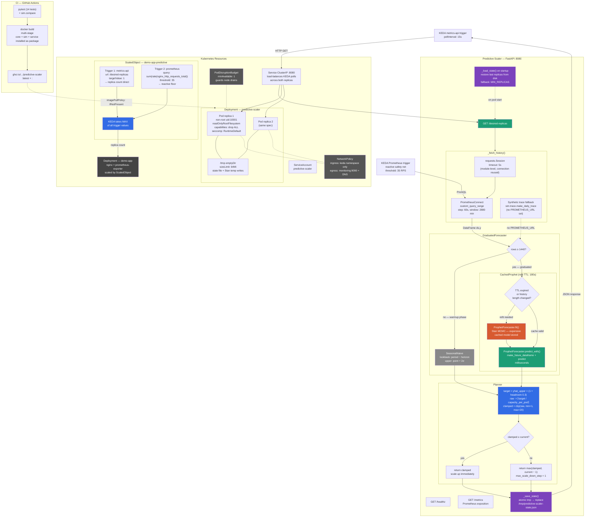

```mermaid
graph TD

    %% ── External trigger ──────────────────────────────────────────────────
    KEDA_POLL["KEDA metrics-api trigger\npollInterval: 15s"]
    PROM_TRIGGER["KEDA Prometheus trigger\nreactive safety net\nthreshold: 35 RPS"]

    %% ── FastAPI service ───────────────────────────────────────────────────
    subgraph service ["Predictive Scaler — FastAPI :8080"]

        EP["GET /desired-replicas"]
        HEALTH["GET /healthz"]
        METRICS["GET /metrics\nPrometheus exposition"]

        subgraph fetch ["_fetch_history()"]
            SESSION["requests.Session\ntimeout: 5s\n(module-level, connection reused)"]
            PROM_CLIENT["PrometheusConnect\ncustom_query_range\nstep: 60s, window: 2880 min"]
            SYNTHETIC["Synthetic trace fallback\nsim.trace.make_daily_trace\n(no PROMETHEUS_URL set)"]
        end

        subgraph forecaster ["GraduatedForecaster"]
            GATE{rows ≥ 1440?}
            NAIVE["SeasonalNaive\nlookback: period − horizon\nupper: point + 2σ"]
            subgraph cached ["CachedProphet  (refit TTL: 180s)"]
                CACHE_CHECK{TTL expired\nor history\nlength changed?}
                FIT["ProphetForecaster.fit()\nStan MCMC — expensive\ncached model stored"]
                PREDICT["ProphetForecaster.predict_with()\nmake_future_dataframe + predict\nmilliseconds"]
            end
        end

        subgraph planner ["Planner"]
            CALC["target = yhat_upper × (1 + headroom 0.3)\nraw  = ⌈target / capacity_per_pod⌉\nclamped = clip(raw, min=1, max=20)"]
            SCALEUP{clamped ≥ current?}
            UP["return clamped\nscale up immediately"]
            DOWN["return max(clamped, current − 1)\nmax_scale_down_step = 1"]
        end

        STATE_LOAD["_load_state() on startup\nrestore last replicas from disk\nfallback: MIN_REPLICAS"]
        STATE_SAVE["_save_state()\natomic tmp → replace\n/tmp/predictive-scaler-state.json"]

    end

    %% ── Kubernetes resources ──────────────────────────────────────────────
    subgraph k8s ["Kubernetes Resources"]

        subgraph deployment ["Deployment — predictive-scaler"]
            R1["Pod replica 1\nnon-root uid:10001\nreadOnlyRootFilesystem\ncapabilities: drop ALL\nseccomp: RuntimeDefault"]
            R2["Pod replica 2\n(same spec)"]
            EMPTYDIR["/tmp emptyDir\nsizeLimit: 64Mi\nstate file + Stan temp writes"]
        end

        PDB["PodDisruptionBudget\nminAvailable: 1\nguards node drains"]
        SVC["Service ClusterIP :8080\nload-balances KEDA polls\nacross both replicas"]
        NP["NetworkPolicy\ningress: keda namespace only\negress: monitoring:9090 + DNS"]
        SA["ServiceAccount\npredictive-scaler"]

        subgraph scaledobject ["ScaledObject — demo-app-predictive"]
            T1["Trigger 1: metrics-api\nurl: /desired-replicas\ntargetValue: 1\n→ replica count direct"]
            T2["Trigger 2: prometheus\nquery: sum(rate(nginx_http_requests_total))\nthreshold: 35\n→ reactive floor"]
            MAX_LOGIC["KEDA takes MAX\nof all trigger values"]
        end

        DEMO["Deployment — demo-app\nnginx + prometheus-exporter\nscaled by ScaledObject"]
    end

    %% ── CI / Image supply chain ───────────────────────────────────────────
    subgraph ci ["CI — GitHub Actions"]
        TEST["pytest (14 tests)\n+ sim.compare"]
        BUILD["docker build\nmulti-stage\ncore + sim + service installed as package"]
        PUSH["ghcr.io/.../predictive-scaler\n:latest + :<git-sha>"]
    end

    %% ── Flow ──────────────────────────────────────────────────────────────
    KEDA_POLL -->|HTTP GET| SVC
    PROM_TRIGGER -->|PromQL| PROM_CLIENT
    SVC --> EP
    EP --> fetch
    SESSION --> PROM_CLIENT
    PROM_CLIENT -->|DataFrame ds,y| GATE
    SYNTHETIC -.->|no PROMETHEUS_URL| GATE

    GATE -->|no — warmup phase| NAIVE
    GATE -->|yes — graduated| CACHE_CHECK
    CACHE_CHECK -->|refit needed| FIT
    FIT --> PREDICT
    CACHE_CHECK -->|cache valid| PREDICT
    NAIVE --> CALC
    PREDICT --> CALC

    CALC --> SCALEUP
    SCALEUP -->|yes| UP
    SCALEUP -->|no| DOWN
    UP --> STATE_SAVE
    DOWN --> STATE_SAVE
    STATE_SAVE -->|JSON response| KEDA_POLL

    STATE_LOAD -.->|on pod start| EP

    T1 --> MAX_LOGIC
    T2 --> MAX_LOGIC
    MAX_LOGIC -->|replica count| DEMO

    R1 --- EMPTYDIR
    R2 --- EMPTYDIR
    R1 -.- NP
    R2 -.- NP
    PDB -.- deployment
    SVC --> R1
    SVC --> R2

    TEST --> BUILD --> PUSH
    PUSH -.->|imagePullPolicy: IfNotPresent| deployment

    style EP fill:#1D9E75,color:#fff
    style FIT fill:#D85A30,color:#fff
    style PREDICT fill:#1D9E75,color:#fff
    style NAIVE fill:#888,color:#fff
    style CALC fill:#326CE5,color:#fff
    style MAX_LOGIC fill:#326CE5,color:#fff
    style PDB fill:#555,color:#fff
    style NP fill:#555,color:#fff
    style STATE_SAVE fill:#7B42BC,color:#fff
    style STATE_LOAD fill:#7B42BC,color:#fff
    style DEMO fill:#444,color:#fff
```
